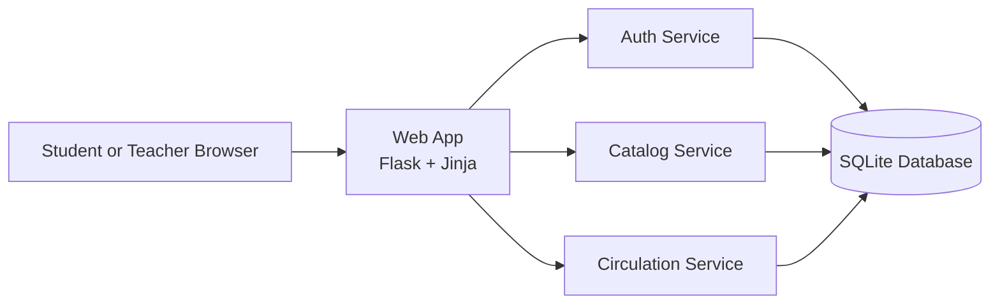
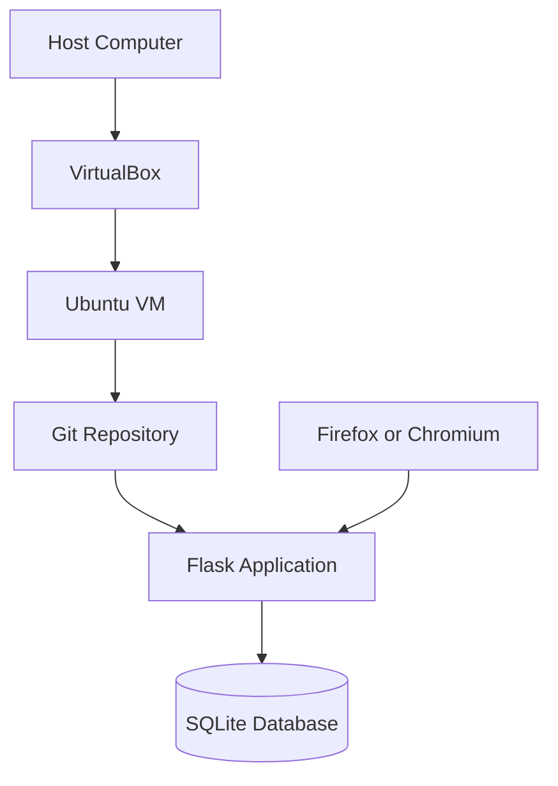

# Architecture Diagrams

## Logical Architecture

## Deployment Architecture

## Explanation

- The browser interacts only with the Flask web application.
- The web application stays thin and delegates operations to small service modules.
- Each service owns a narrow responsibility.
- SQLite keeps deployment simple enough for a school seminar and Ubuntu VM demo.
